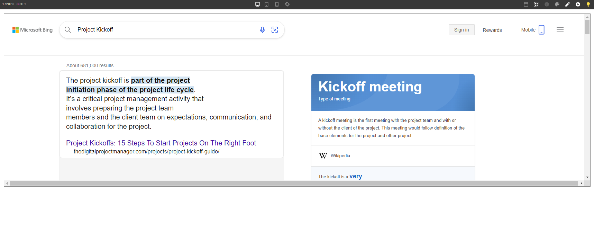

# Overview

**The IFrame Component** represents a nested browsing context, embedding another HTML page into your page.

## Properties

| Name             | Type            | Default                           | Description                                                                                                                   |
| ---------------- | --------------- | --------------------------------- | ----------------------------------------------------------------------------------------------------------------------------- |
| Name             | string          | 'iframe'                          | Name of the `iframe`                                                                                                          |
| Allow Fullscreen | boolean         | false                             | Allow fullscreen mode                                                                                                         |
| Permissions      | Array of string | ['']                              | defines what features are available to the `iframe` (for example, access to the microphone, camera, battery, web-share, etc.) |
| Referrer Policy  | string          | 'strict-origin-when-cross-origin' | Indicates which referrer to send when fetching the `iframe`'s resource                                                        |
| Sandbox          | Array of string | ['']                              | Controls the restrictions applied to the content embedded in the `iframe`                                                     |
| Loading          | string          | 'eager'                           | Controls the loading behavior of the `iframe`                                                                                 |

### `Referrer Policy` values:

- `no-referrer` : The Referer header will not be sent.
- `no-referrer-when-downgrade` : The Referer header will not be sent to origins without TLS (HTTPS).
- `origin` : The sent referrer will be limited to the origin of the referring page: its scheme, host, and port.
- `origin-when-cross-origin` : The referrer sent to other origins will be limited to the scheme, the host, and the port. Navigations on the same origin will still include the path.
- `same-origin` : A referrer will be sent for same origin, but cross-origin requests will contain no referrer information.
- `strict-origin` : A referrer will be sent for same origin, but cross-origin requests will contain the origin of the referring page.
- `strict-origin-when-cross-origin` : The referrer sent to other origins will be limited to the scheme, the host, and the port. Navigations on the same origin will still include the path.

### `Sandbox` values:

- `allow-forms` : Allows the page to submit forms. If this keyword is not used, a form will be displayed as normal, but submitting it will not trigger input validation, send data to a web server, or close a dialog.
- `allow-modals` : Allows the page to display modal dialogs, such as `window.confirm()` and `window.alert()`.
- `allow-popups` : Allows popups such as `window.open()`.
- `allow-popups-to-escape-sandbox` : Allows a sandboxed document to open a new browsing context without forcing the sandboxing flags upon it.
- `allow-scripts` : Allows the page to run scripts (but not create pop-up windows).
- `allow-storage-access-by-user-activation Experimental` : Allows a document loaded in the `iframe` to use the Storage Access API to request access to unpartitioned cookies.
- `allow-same-origin` : If this token is not used, the resource is treated as being from a special origin that always fails the same-origin policy (potentially preventing access to data storage/cookies and some JavaScript APIs).
- `allow-top-navigation` : Lets the resource navigate the top-level browsing context (the one named \_top).
- `allow-top-navigation-by-user-activation` : Lets the resource navigate the top-level browsing context, but only if initiated by a user gesture.
- `allow-downloads` : Allows downloading files.
- `allow-orientation-lock` : Allows locking the screen orientation.
- `allow-pointer-lock` : Allows the page to use the Pointer Lock API.
- `allow-presentation` : Allows embedders to have control over whether an iframe can start a presentation session.

## Datasource

| Name       | Type     | Description                                                                    |
| ---------- | -------- | ------------------------------------------------------------------------------ |
| Datasource | `String` | A String Datasource that serves as the source (src) for the `IFrame` component |
